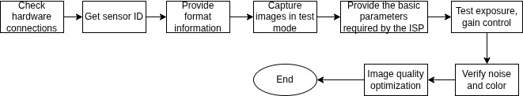

.. _camera_sensor_test:

Camera Sensor Tuning
====================

:link_to_translation:`zh_CN:[中文]`

This document describes the driver development workflow and key considerations during camera sensor tuning. Follow the workflow shown below to perform camera sensor tuning:

    Camera Sensor Tuning Workflow

Preparation
-----------

Confirm Technical Specifications
^^^^^^^^^^^^^^^^^^^^^^^^^^^^^^^^

Before developing the camera sensor driver, read the sensor datasheet and design guide. Check whether the sensor's frame rate, output size, and data format meet the SoC interface requirements, and request an initialization configuration list from the sensor vendor in the following format:

.. code-block:: none

    Sensor name: OV2710
    SoC name: ESP32-P4
    Output size: 640x480
    FPS: 30
    Input Clock: 24 MHz
    Output mode: Linear mode
    Interface: MIPI 2 data lanes
    Output format: RGB RAW8

For initialization settings, prepare at least two sequences: one for the maximum specification and one for a standard resolution.

.. attention::

    For sensors using the MIPI interface, ensure the MIPI parameters meet the receiver's requirements. Each data lane rate must not exceed 1.0 Gbps, line sync packets must be disabled, and the MIPI clock should run in non-continuous mode.

Hardware Connections
^^^^^^^^^^^^^^^^^^^^

Based on the chosen camera interface and referencing the official development board schematics, request a camera module from the module vendor. During the module's hardware design, pay particular attention to:

- The sensor's power rails: AVDD, DVDD, and DOVDD.
- Whether the sensor's XCLK input uses an external crystal or the SoC's output clock.
- Whether the PWDN (Power Down) and RST (Reset) pins are connected to the sensor.

Connection methods differ by interface.

- For SPI-interface sensors, the connection to the development board is as follows:

    .. code-block:: none

        ------------------                      ------------------
        |  Camera Sensor  |                      | SoC            |
        |                 |      Data Link       |                |
        |          Data1  |--------------------->| Data1          |
        |          Data0  |--------------------->| Data0          |
        |                 |                      |                |
        | XCLK (Optional) |<---------------------| XCLK           |
        |          VSYNC  |--------------------->| VSYNC          |
        |          PCLK   |--------------------->| PCLK           |

        ------------------                      ------------------
        |      I2C Slave  |   SCCB Control Link  | I2C Master     |
        |            SCL  |<---------------------| SCL            |
        |            SDA  |<-------------------->| SDA            |
        ------------------                      ------------------

- For DVP-interface sensors, the connection to the development board is as follows:

    .. code-block:: none

        ------------------                      ------------------
        |  Camera Sensor |                      | SoC            |
        |                |      Data Link       |                |
        |          Data7 |--------------------->| Data7          |
        |          Data6 |--------------------->| Data6          |
        |          Data5 |--------------------->| Data5          |
        |          Data4 |--------------------->| Data4          |
        |          Data3 |--------------------->| Data3          |
        |          Data2 |--------------------->| Data2          |
        |          Data1 |--------------------->| Data1          |
        |          Data0 |--------------------->| Data0          |
        |                |                      |                |
        |          PCLK  |--------------------->| PCLK           |
        |          HREF  |--------------------->| HREF           |
        |          VSYNC |--------------------->| VSYNC          |
        |                |                      |                |

        ------------------                      ------------------
        |      I2C Slave |     Control Link     | I2C Master     |
        |            SCL |<---------------------| SCL            |
        |            SDA |<-------------------->| SDA            |
        ------------------                      ------------------

- For MIPI-interface sensors, the connection to the development board is as follows:

    .. code-block:: none

        ------------------                      ------------------
        | CSI Transmitter |                      | CSI Receiver   |
        |                 |      Data Link       |                |
        |          Data1+ |--------------------->| Data1+         |
        |          Data1- |--------------------->| Data1-         |
        |          Data0+ |--------------------->| Data0+         |
        |          Data0- |--------------------->| Data0-         |
        |                 |                      |                |
        |            CLK+ |--------------------->| CLK+           |
        |            CLK- |--------------------->| CLK-           |
        |                 |                      |                |

        ------------------                      ------------------
        |       CCI Slave |     Control Link     | CCI Master     |
        |             SCL |<---------------------| SCL            |
        |             SDA |<-------------------->| SDA            |
        ------------------                      ------------------

Read the Sensor ID
------------------

.. _cam-sensor-driver-prepare:

Prepare a Sensor Driver
^^^^^^^^^^^^^^^^^^^^^^^

Reading the sensor ID in software verifies both the hardware connections and I2C communication. To do this, first implement the sensor driver.

You can adapt an existing driver for a sensor with similar specifications to bring up your own driver. For details, see `Add new camera sensor drivers <https://github.com/espressif/esp-video-components/tree/master/esp_cam_sensor#add-new-camera-sensor-drivers>`_.

.. important::

    The esp_cam_sensor component uses a 7-bit I2C address by default.

Test I2C Communication
^^^^^^^^^^^^^^^^^^^^^^

With correct wiring and pin configuration, run the `capture stream <https://github.com/espressif/esp-video-components/tree/master/esp_video/examples/capture_stream>`_ example. If you see logs like the following, the test is successful.

.. code-block:: none

    I (5310) example_init_video: MIPI-CSI camera sensor I2C port=0, scl_pin=8, sda_pin=7, freq=100000
    I (5320) ov5645: Detected Camera sensor PID=0x5645

.. attention::

    - If you need to control the sensor's PWDN and RST pins, it is recommended to toggle these levels in the application layer.
    - If generating the XCLK signal from SoC pins, refer to the APIs in the `xclk_generator <https://github.com/espressif/esp-video-components/tree/master/esp_cam_sensor/test_apps/xclk_generator>`_ example to generate this signal.
    - With pins configured correctly, sensor power good, and XCLK present, you can also try the `i2c_tools <https://github.com/espressif/esp-idf/tree/master/examples/peripherals/i2c/i2c_tools>`_ example to probe the device's I2C address.

Complete the Format Information
-------------------------------

Based on the sensor datasheet and the initialization list provided by the sensor vendor, fill out the ``esp_cam_sensor_format_t`` structure that represents the sensor format. For OV2710, it includes:

.. code-block:: c

    static const esp_cam_sensor_format_t ov2710_format_info[] = {
        /* For MIPI */
        {
            .name = "MIPI_1lane_24Minput_RAW10_1920x1080_25fps",
            .format = ESP_CAM_SENSOR_PIXFORMAT_RAW10,
            .port = ESP_CAM_SENSOR_MIPI_CSI,
            .xclk = OV2710_MCLK,
            .width = 1920,
            .height = 1080,
            .regs = ov2710_mipi_1lane_24Minput_1920x1080_raw10_25fps,
            .regs_size = ARRAY_SIZE(ov2710_mipi_1lane_24Minput_1920x1080_raw10_25fps),
            .fps = 25,
            .isp_info = &ov2710_isp_info[0],
            .mipi_info = {
                .mipi_clk = 800000000,
                .lane_num = 1,
                .line_sync_en = false,
            },
            .reserved = NULL,
        }
    };

.. attention::

    - For MIPI-interface sensors, you can obtain MIPI interface details from the sensor's FAE or from the vendor-provided register initialization list.
    - Typically, the register initialization list follows the order soft reset -> standby enable -> sensor format init, and data output begins after calling ``sensor_set_stream()`` to exit standby (standby disable).

Capture Images in Test Pattern Mode
-----------------------------------

The sensor's test pattern mode outputs data with a known pattern, which helps verify that the receiver configuration matches that of the transmitter. Refer to the sensor's datasheet to implement the API for enabling the test pattern mode. Then, build and run image-preview `examples <https://github.com/espressif/esp-video-components/tree/master/esp_video/examples>`_ to verify that the test pattern image matches expectations.

Using OV2710 as an example:

- Implement ``ov2710_set_test_pattern()`` to enable the test pattern mode.
- Call ``ov2710_set_test_pattern()`` before ``ov2710_set_stream()`` returns.
- Build and run the example to preview the test pattern image.

.. attention::

    - For some YUV-output sensors, initialization and data reception may succeed, yet the displayed colors appear incorrect. This is usually caused by mismatched signal polarities, pin drive strength, endianness settings, and the YUYV byte order.
    - For RAW-output sensors, the format also includes Image Signal Processor (ISP) information. Incorrect ISP parameters may distort the image but do not affect data reception. If the test pattern image after ISP processing looks wrong, try adjusting the ``bayer_type`` field in ``esp_cam_sensor_isp_info_t`` until the image matches the datasheet. Note that the sensor's vflip and hmirror features also affect the ``bayer_type`` setting.
    - It is recommended to run the web example to preview images in a browser. You can also preview images via LCD, USB, or other interfaces.

Complete ISP Features
---------------------

For RAW-output sensors, you should also provide correct control information for the ISP peripheral.

For Auto Exposure (AE) control, refer to the sensor datasheet and implement the following interfaces in order:

- ``sensor_set_exp_val()``: sets the sensor exposure time.
- ``sensor_set_total_gain_val()``: sets the overall gain. Sensor gain comprises digital gain and analog gain; total gain = analog gain × digital gain.
- ``sensor_query_para_desc()``: queries ranges and default values for exposure and gain.
- ``sensor_set_para_value()``: sets ISP control parameters for the sensor.

.. attention::

    - Some RAW-output sensors provide real-time statistics such as black level and luminance. These sensors require special APIs and additional ISP parameters. Please contact Espressif technical support for assistance.
    - Ensure the default ISP control values, such as default exposure and gain, match the corresponding register list.

Test AE Configuration
---------------------

After completing AE configuration, enable a timer that calls the exposure and gain setting APIs to increment or decrement configuration parameters. In image preview `examples <https://github.com/espressif/esp-video-components/tree/master/esp_video/examples>`_, verify that brightness transitions smoothly.

Assist ISP Tuning Engineers with Image Quality Optimization
-----------------------------------------------------------

Validate Noise and Color
^^^^^^^^^^^^^^^^^^^^^^^^

Sensor driver developers should work with ISP tuning engineers to evaluate noise at different gains, refine the gain control array and exposure control, and balance smooth brightness transitions with noise levels. Additionally, for sensors with partial on-chip ISP, ISP-related features such as Black Level Correction (BLC) and Defective Pixel Correction (DPC) should also be validated with the ISP tuning team.

Image Quality Optimization
^^^^^^^^^^^^^^^^^^^^^^^^^^

Assist image quality tuning engineers in optimizing image quality.
