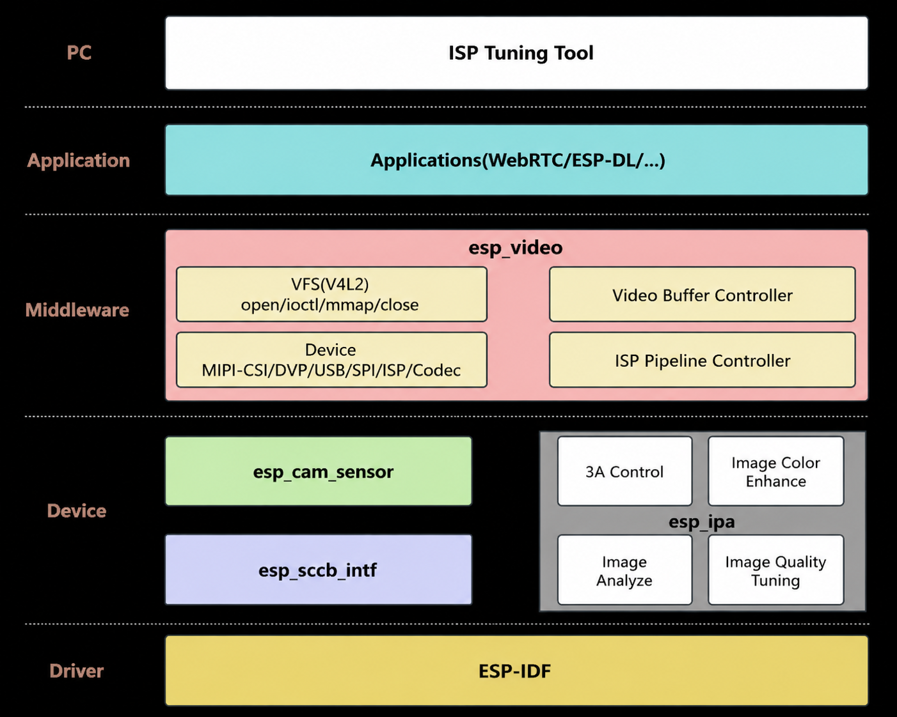

Get Started
==============================================

:link_to_translation:`zh_CN:[中文]`

.. important::
  Before using esp-video-components, please read the :doc:`../disclaimer` and follow the terms and precautions therein.

Overview
-------------------------------------------
esp-video-components is Espressif's official camera system development and application framework. It mainly includes the following sub-components:

- `esp_cam_sensor <https://github.com/espressif/esp-video-components/tree/master/esp_cam_sensor>`_: This component provides the underlying drivers for three camera sensors including MIPI-CSI, DVP, and SPI.
- `esp_ipa <https://github.com/espressif/esp-video-components/tree/master/esp_ipa>`_: This component provides library files for image processing algorithms. Usually, for camera sensors that output data in ``RAW format``, real-time control of algorithms such as AE and AWB is required to obtain clearer images.
- `esp_sccb_intf <https://github.com/espressif/esp-video-components/tree/master/esp_sccb_intf>`_: This component provides the driver for the camera control bus.
- `esp_video <https://github.com/espressif/esp-video-components/tree/master/esp_video>`_: This component relies on esp_cam_sensor, esp_ipa, and esp_h264 components to implement an API compatible with the Linux V4L2 standard. Users can add this component to their project to quickly add the visual features they need.

According to the data interface of the camera sensor, the chips supported by esp-video-components are:

.. list-table::
  :header-rows: 1

  * - SoC
    - MIPI-CSI
    - DVP
    - USB
    - SPI
  * - ESP32-P4
    - supported
    - supported
    - supported
    - supported
  * - ESP32-S3
    -
    - supported
    - supported
    - supported
  * - ESP32-C3
    -
    - 
    - 
    - supported
  * - ESP32-C5
    -
    - 
    - 
    - supported
  * - ESP32-C6
    -
    - 
    - 
    - supported
  * - ESP32-C61
    -
    - 
    - 
    - supported

System architecture
-------------------------------------------------------

   esp_video System Framework

From an organizational structure perspective, it is divided into five layers: PC-side tuning and analysis tools, application layer, application framework layer, device layer, and kernel layer.

- PC-based tuning and analysis tools for previewing images, analyzing image quality, tuning image system parameters online, and calibrating image processing unit parameters.
- The application layer primarily uses various APIs provided by esp_video for application development.
- esp_video is the application framework layer. It not only manages the various devices and libraries in the device layer but also provides efficient and convenient API interfaces to applications. As middleware for the entire system, it provides a unified interface to upper layers and a unified standard to lower-layer components to facilitate compatible control of various devices.
- The device layer includes the underlying implementation of camera sensor devices and image processing control algorithm libraries, and provides a unified interface for calling upper layers.
- The kernel layer consists of the operating system and device driver code provided by esp-idf.

Development Board Overview
-------------------------------------------

There are some development boards with camera interfaces that can be used to start testing more easily. There are some development boards with camera interfaces that can be used to start testing more easily. And it is recommended to refer to the camera interfaces of these development boards to design hardware.

.. only:: esp32p4

    - `ESP32-P4-Function-EV-Board <https://docs.espressif.com/projects/esp-dev-kits/en/latest/esp32p4/esp32-p4x-function-ev-board/index.html>`_
    - `ESP32-P4-EYE <https://docs.espressif.com/projects/esp-dev-kits/en/latest/esp32p4/esp32-p4x-eye/index.html>`_

Build Your First Project
-------------------------------------------

Installing ESP-IDF
^^^^^^^^^^^^^^^^^^^^^^^

Please configure your computer according to the "Getting Started" section of the `ESP-IDF Programming Guide <https://docs.espressif.com/projects/esp-idf/zh_CN/latest/esp32p4/get-started/index.html>`_. If this is your first time using ESP-IDF, it is recommended that you familiarize yourself with the `hello_world <https://github.com/espressif/esp-idf/tree/master/examples/get-started/hello_world>`_ example first.

Running Examples
^^^^^^^^^^^^^^^^^^^^^^^^

The esp-video-components repository contains commonly used `examples <https://github.com/espressif/esp-video-components/tree/master/esp_video/examples>`_. Users can run the command ``git clone --recursive https://github.com/espressif/esp-video-components.git`` to obtain the source code of this repository. Then refer to the `README <https://github.com/espressif/esp-video-components/tree/master/esp_video/examples/capture_stream#readme>`_ in the **capture_stream** example to compile and run the example.

Adding Components to a Custom Project
^^^^^^^^^^^^^^^^^^^^^^^^^^^^^^^^^^^^^^^^^^^^^

Users can add the esp_video component by executing the command ``idf.py add-dependency esp_video`` in the root folder of the project directory. When you need to modify the source code of a component, you can refer to the `main/idf_component.yml <https://github.com/espressif/esp-video-components/blob/master/esp_video/examples/capture_stream/main/idf_component.yml>`_ file of the capture_stream and specify the local component path using the ``override_path`` directive.

For more information on component management and usage, please refer to `Component Management and Usage <https://docs.espressif.com/projects/esp-techpedia/zh_CN/latest/esp-friends/advanced-development/component-management.html>`_.