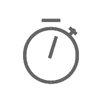

ESP-Video-Components Development Reference
===============================================

:link_to_translation:`zh_CN:[中文]`

This is the documentation center for Espressif's Camera Application Development Framework (`esp-video-components <https://github.com/espressif/esp-video-components>`_). 

=======================  =======================  =======================
 |Get Started|_            |Camera Sensor|_         |About|_
-----------------------  -----------------------  -----------------------
 `Get Started`_            `Camera Sensor`_         `About`_
=======================  =======================  =======================

.. _Get Started: Get_Started/index.html

.. |Camera Sensor| image:: ../_static/camera-sensor.png
.. _Camera Sensor: ESP_Camera_Sensor/index.html

.. _About: about.html

.. toctree::
   :hidden:

   Get Started <Get_Started/index>
   Camera Sensor Development and Testing Guide <ESP_Camera_Sensor/index>
   Index of Abbreviations <index_of_abbreviations>
   Technology selection <Technology_Selection>
   Disclaimer <disclaimer>
   Changelog <Changelog>
   About <about>
   
* :ref:`genindex`