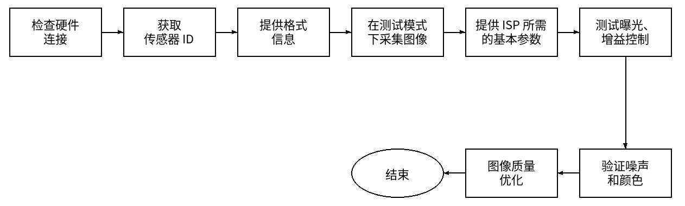

.. _camera_sensor_test:

相机传感器调试
==============

:link_to_translation:`en:[English]`

本文档主要介绍相机传感器调试过程中的驱动开发流程及注意事项。相机传感器调试可按照下图所示流程实施：

    传感器调试流程

准备材料
--------

确认技术参数
^^^^^^^^^^^^

开发相机传感器的驱动程序前，先获取相机传感器的技术规格书以及设计指南，了解相机传感器的帧率、输出尺寸、数据格式是否符合芯片的接口需求，并按照如下格式向传感器原厂申请初始化配置列表：

.. code-block:: none

    Sensor name: OV2710
    SoC name: ESP32-P4
    Output size: 640x480
    FPS: 30
    Input Clock: 24 MHz
    Output mode: Linear mode
    Interface: MIPI 2 data lanes
    Output format: RGB RAW8

获取传感器初始化设置，一般至少要准备最大规格和标准分辨率两种序列。

.. attention::

    对于使用 MIPI 接口的传感器，注意 MIPI 的一些参数需要符合接收端的需求。要求每个数据线的速率不大于 1.0 Gbps，禁用行同步包，MIPI 时钟采用非连续模式。

硬件连接
^^^^^^^^

根据使用的相机接口，参考官方开发板的电路设计，向负责制作相机模组的厂商申请相机模组。相机模组的硬件设计过程中需要重点关注以下几个方面：

- 相机传感器的供电电源，包括 AVDD、DVDD、DOVDD。
- 相机传感器的输入时钟 XCLK 是使用外部晶振还是使用芯片的输出时钟。
- PWDN (Power Down)、RST (Reset) 管脚是否与传感器连接。

不同接口的传感器模组与开发板的连接的方式不同。

- SPI 接口的相机传感器与开发板连接的示意图如下：

    .. code-block:: none

        ------------------                      ------------------
        |       相机传感器 |                      | 芯片           |
        |                |        数据链路       |                |
        |          Data1 |--------------------->| Data1          |
        |          Data0 |--------------------->| Data0          |
        |                |                      |                |
        | XCLK(Optional) |<---------------------| XCLK           |
        |          VSYNC |--------------------->| VSYNC          |
        |          PCLK  |--------------------->| PCLK           |

        ------------------                      ------------------
        |        I2C 从机 |     SCCB 控制链路     | I2C 主机        |
        |            SCL |<---------------------| SCL            |
        |            SDA |<-------------------->| SDA            |
        ------------------                      ------------------

- DVP 接口的相机传感器与开发板连接的示意图如下：

    .. code-block:: none

        ------------------                      ------------------
        |       相机传感器 |                      | 芯片           |
        |                |        数据链路       |                |
        |          Data7 |--------------------->| Data7          |
        |          Data6 |--------------------->| Data6          |
        |          Data5 |--------------------->| Data5          |
        |          Data4 |--------------------->| Data4          |
        |          Data3 |--------------------->| Data3          |
        |          Data2 |--------------------->| Data2          |
        |          Data1 |--------------------->| Data1          |
        |          Data0 |--------------------->| Data0          |
        |                |                      |                |
        |          PCLK  |--------------------->| PCLK           |
        |          HREF  |--------------------->| HREF           |
        |          VSYNC |--------------------->| VSYNC          |
        |                |                      |                |

        ------------------                      ------------------
        |        I2C 从机 |       控制链路        | I2C 主机        |
        |            SCL |<---------------------| SCL            |
        |            SDA |<-------------------->| SDA            |
        ------------------                      ------------------

- MIPI 接口的相机传感器与开发板连接的示意图如下：

    .. code-block:: none

        ------------------                      -------------------
        |      CSI 发送端  |                      | CSI 接收端      |
        |                 |        数据链路       |                |
        |          Data1+ |--------------------->| Data1+         |
        |          Data1- |--------------------->| Data1-         |
        |          Data0+ |--------------------->| Data0+         |
        |          Data0- |--------------------->| Data0-         |
        |                 |                      |                |
        |            CLK+ |--------------------->| CLK+           |
        |            CLK- |--------------------->| CLK-           |
        |                 |                      |                |

        ------------------                      -------------------
        |        CCI 从机  |        控制链路       | CCI 主机        |
        |            SCL  |<---------------------| SCL            |
        |            SDA  |<-------------------->| SDA            |
        ------------------                      -------------------

获取传感器 ID
-------------

.. _cam-sensor-driver-prepare:

准备传感器驱动
^^^^^^^^^^^^^^

通过软件程序查询相机传感器的 ID，可以验证硬件连接是否正确、以及 I2C 通信是否正常。这需要先实现相机传感器的驱动程序。

可以找一款规格相近的相机传感器，参考其驱动进行修改适配。更多介绍可以参考 `Add new camera sensor drivers <https://github.com/espressif/esp-video-components/tree/master/esp_cam_sensor#add-new-camera-sensor-drivers>`_ 。

.. important::

    esp_cam_sensor 组件中默认使用 7 bit 的 I2C 地址。

测试 I2C 通信
^^^^^^^^^^^^^

在硬件连接正确，设备的管脚配置正确的情况下，运行 `capture stream <https://github.com/espressif/esp-video-components/tree/master/esp_video/examples/capture_stream>`_ 示例，若显示如下日志则说明测试正常。

.. code-block:: none

    I (5310) example_init_video: MIPI-CSI camera sensor I2C port=0, scl_pin=8, sda_pin=7, freq=100000
    I (5320) ov5645: Detected Camera sensor PID=0x5645

.. attention::

    - 如果需要配置相机传感器的 PWDN 和 RST 管脚，推荐在应用层代码中控制这些接口的电平。
    - 如果使用芯片管脚输出 XCLK 时钟信号，请参考 `xclk_generator <https://github.com/espressif/esp-video-components/tree/master/esp_cam_sensor/test_apps/xclk_generator>`_ 示例中的 API 来生成该信号。
    - 在管脚配置正确，传感器供电正常，XCLK 正常的情况下，也可以尝试使用 `i2c_tools <https://github.com/espressif/esp-idf/tree/master/examples/peripherals/i2c/i2c_tools>`_ 示例来探测设备的 I2C 地址信息。

完善传感器格式信息
------------------

参考相机传感器的技术手册以及传感器厂家提供的初始化列表，完善代表传感器格式信息的结构体 ``esp_cam_sensor_format_t`` 。以 OV2710 为例，该结构体包含的信息有：

.. code-block:: c

    static const esp_cam_sensor_format_t ov2710_format_info[] = {
        /* 对于 MIPI 接口的传感器 */
        {
            .name = "MIPI_1lane_24Minput_RAW10_1920x1080_25fps",
            .format = ESP_CAM_SENSOR_PIXFORMAT_RAW10,
            .port = ESP_CAM_SENSOR_MIPI_CSI,
            .xclk = OV2710_MCLK,
            .width = 1920,
            .height = 1080,
            .regs = ov2710_mipi_1lane_24Minput_1920x1080_raw10_25fps,
            .regs_size = ARRAY_SIZE(ov2710_mipi_1lane_24Minput_1920x1080_raw10_25fps),
            .fps = 25,
            .isp_info = &ov2710_isp_info[0],
            .mipi_info = {
                .mipi_clk = 800000000,
                .lane_num = 1,
                .line_sync_en = false,
            },
            .reserved = NULL,
        }
    };

.. attention::

    - 对于 MIPI 接口的传感器，MIPI 的接口信息可以咨询传感器的 FAE 或者查看原厂提供的寄存器初始化列表信息。
    - 通常传感器的寄存器初始化列表会按照 soft reset -> standby enable -> sensor format init 的顺序进行配置，然后在调用 ``sensor_set_stream()`` 时切换到 standby disable 模式来输出数据。

在测试模式下采集图像
--------------------

传感器的测试模式可以输出有一定规律的数据，这有助于检查接收端的配置是否与发送端匹配。你可以参考相机传感器的技术手册，实现该传感器测试模式的使能接口。然后编译并运行可以预览图像的 `examples <https://github.com/espressif/esp-video-components/tree/master/esp_video/examples>`_ ，确认测试模式下的图像是否符合预期。

以 OV2710 为例，需要以下步骤来完成：

- 实现使能测试模式的接口 ``ov2710_set_test_pattern()`` 。
- 在 ``ov2710_set_stream()`` 函数返回前，调用 ``ov2710_set_test_pattern()`` 启用测试模式。
- 编译示例，预览测试模式的图像。

.. attention::

    - 尽管一些输出 YUV 数据的传感器可以正常被初始化并在接收端接收到数据，但是最终显示的图像颜色异常。此时应检查传感器的信号极性、管脚驱动能力，数据大小端配置以及 YUYV 发送顺序。
    - 对于输出 RAW 数据的传感器，格式信息中还包括图像信号处理器 (Image Signal Processor, ISP) 信息。不正确的 ISP 信息将导致图像异常，但是不影响接收数据。若测试模式下编码后的图像异常，可以尝试更改 ``esp_cam_sensor_isp_info_t`` 中的 ``bayer_type`` 参数，直到测试图像与传感器技术规格书的一致。另外，传感器的 vflip 和 hmirror 功能会影响传感器的 bayer_type 参数。
    - 推荐通过运行 web 示例在浏览器中预览图像，也可以通过 LCD、USB 等接口预览。

完善 ISP 功能
-------------

对于输出 RAW 数据的传感器，还需提供正确的控制信息供 ISP 外设使用。

其中关于自动曝光 (Auto Exposure, AE) 控制信息，请参考相机传感器的技术手册，并按照如下顺序实现相关的接口：

- ``sensor_set_exp_val()``：该接口用于设置相机传感器的曝光时间。
- ``sensor_set_total_gain_val()``：该接口用于设置相机传感器的增益信息。传感器的增益分为数字增益、模拟增益，该接口设置总增益，总增益 = 模拟增益 x 数字增益。
- ``sensor_query_para_desc()``：该接口用于查询相机传感器的曝光、增益取值范围，默认值等信息。
- ``sensor_set_para_value()``：该接口用于设置相机传感器的 ISP 控制参数。

.. attention::

    - 一些输出 RAW 数据的传感器可以输出黑电平、亮度的实时统计数据。这些传感器需要特殊的 API，并完善 ISP 相关的其他参数，请联系乐鑫的技术人员完成技术支持。
    - 传感器默认的 ISP 控制信息，比如默认的曝光值、增益值，请确认与对应的寄存器列表信息一致。

测试 AE 配置
------------

在完善 AE 配置信息后，可以启用一个定时器，在定时器中调用设置曝光、增益控制的接口，让配置参数递增或者递减变化，在可以预览图像的 `examples <https://github.com/espressif/esp-video-components/tree/master/esp_video/examples>`_ 中，查看图像的亮度是否平滑地过渡。

协助 ISP 调优人员进行图像质量调优
---------------------------------

验证噪声和颜色
^^^^^^^^^^^^^^

传感器驱动开发人员需要配合 ISP 调试人员验证不同增益下的噪声情况，完善增益的控制数组以及曝光时间的控制，平衡亮度变化的平滑性和噪声情况。此外，对于一些拥有部分 ISP 的传感器，其 ISP 相关的功能，如黑电平校正、坏点校正功能，也需要配合 ISP 调试人员进行验证。

图像质量调优
^^^^^^^^^^^^

协助图像质量调试人员优化图像质量。
