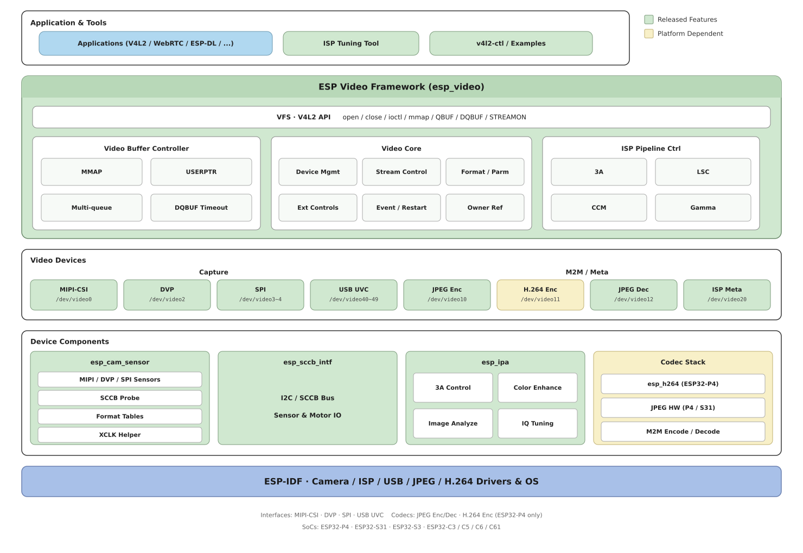
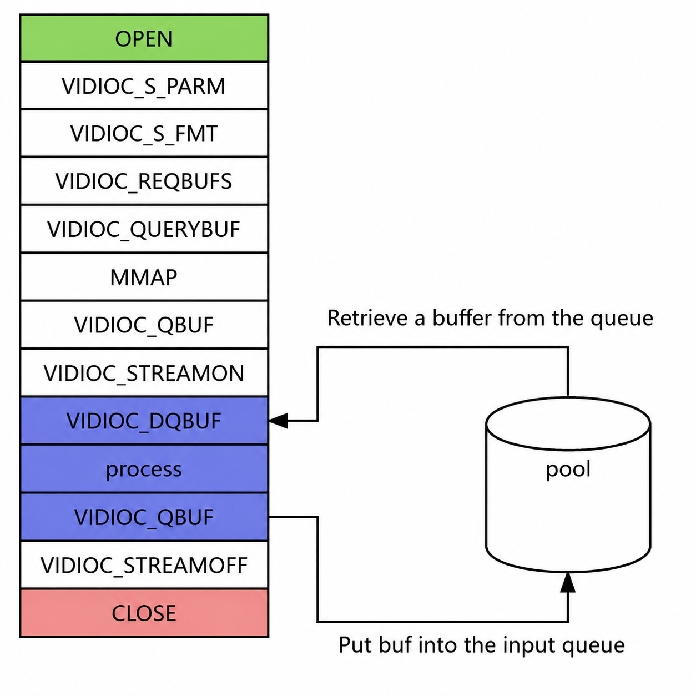

*****************************************
ESP Video 应用开发指南
*****************************************

概述
------

``esp_video`` 组件为乐鑫 ESP32 系列芯片提供视频采集与图像处理能力。它实现 Linux V4L2（Video for Linux Two）规范的子集，把相机传感器驱动、ISP（图像信号处理）和硬件编解码等细节封装在内部，向上层提供统一的设备节点（如 ``/dev/video0``）。应用层按常见 V4L2 采集流程开发即可，平台适配成本较低。

主要设计特点如下：

- **标准兼容**：API 遵循 V4L2 规范子集，支持常用 ioctl、请求代码与缓冲区流式处理，便于现有 Linux 应用迁移与复用。
- **分层架构**：上层提供标准应用接口，中间层负责设备管理与缓冲控制，下层对接硬件驱动并响应回调，便于扩展多种相机传感器。
- **高效队列**：支持多缓冲队列（含 MMAP、USERPTR 等模式），满足高帧率、低延迟采集需求。
- **灵活适配**：底层 HAL（硬件抽象层）以插件方式适配不同相机传感器、ISP 及编解码模块，覆盖多种 ESP32 系列芯片。
- **便于二次开发**：接口、结构体与返回码参考 V4L2 及行业惯例，并针对嵌入式平台做了内存与性能方面的取舍。

本指南按阅读顺序介绍软件架构、硬件能力与设备节点、数据通路，以及工程集成与应用编程。ioctl 请求代码与命令参数见 :doc:`commands`；初始化 API 见 :doc:`api_reference`。

.. toctree::
   :maxdepth: 1
   :hidden:

   命令介绍 <commands>
   API 参考 <api_reference>

软件架构
-----------

``esp_video`` 采用分层设计：应用通过 V4L2 ioctl 访问设备节点；中间层完成设备管理、格式协商与缓冲队列；下层经 HAL 对接 MIPI-CSI、DVP、SPI、USB、ISP 及硬件编解码驱动。分层结构如下图所示。

   esp_video 分层架构

硬件与设备节点
----------------

芯片与外设
^^^^^^^^^^

各芯片可用的相机接口与编解码外设如下。实际能否使用某路设备，还取决于 menuconfig 中是否使能对应选项。

.. list-table::
   :header-rows: 1
   :width: 100%
   :widths: auto
   :align: left

   * - SoC
     - MIPI-CSI
     - DVP
     - SPI
     - JPEG 编码器
     - JPEG 解码器
     - H.264 编码器
     - ISP
     - USB
   * - ESP32-P4
     - Y
     - Y
     - Y
     - Y
     - Y
     - Y
     - Y
     - Y
   * - ESP32-S31
     - N
     - Y
     - Y
     - Y
     - Y
     - N
     - N
     - Y
   * - ESP32-S3
     - N
     - Y
     - Y
     - N
     - N
     - N
     - N
     - Y
   * - ESP32-C3
     - N
     - N
     - Y
     - N
     - N
     - N
     - N
     - N
   * - ESP32-C5
     - N
     - N
     - Y
     - N
     - N
     - N
     - N
     - N
   * - ESP32-C6
     - N
     - N
     - Y
     - N
     - N
     - N
     - N
     - N
   * - ESP32-C61
     - N
     - N
     - Y
     - N
     - N
     - N
     - N
     - N

.. note::
   1. 开启 ISP 时，MIPI-CSI 支持输入 RAW8/10 位图像，输出 RAW8/RGB888/RGB565/YUV420/YUV422(UYVY)。关闭 ISP 时，MIPI-CSI 直接输出相机传感器产生的图像。

   2. ESP32-P4 v3.0 及以上芯片在 MIPI-CSI 模块内增加了图像格式转换，可将输入的 RGB888/RGB565/YUV420/YUV422(UYVY/YUYV/VYUY/YVYU) 转换为上述同类格式。

   3. SPI 接口相机最少使用 3 个引脚即可接收图像：V-SYNC、PCLK 和 Data。若需提升帧率和分辨率，可增加 Data 位数（例如 2 位或 4 位），同时会增加占用的引脚数。使能 ``ESP_VIDEO_ENABLE_THE_SECOND_SPI_VIDEO_DEVICE`` 后可使用第二路 SPI 设备 ``/dev/video4``。

   4. JPEG 硬件编码器、解码器适用于带 JPEG 编解码器的芯片（ESP32-P4、ESP32-S31）。H.264 硬件编码器仅适用于 ESP32-P4。当前不提供 H.264 硬件解码器设备。

   5. ESP32-P4 ECO3 及以上版本中，JPEG 硬件编码器额外支持 ``V4L2_PIX_FMT_YUV420`` 与 ``V4L2_PIX_FMT_YUV444``；JPEG 硬件解码器额外支持 ``V4L2_PIX_FMT_YUV420``。解码器还支持交换 RGB 通道顺序，从而输出 BGR565 / BGR888。

设备节点
^^^^^^^^^^

``esp_video`` 通过设备节点（文件描述符）管理 MIPI-CSI、DVP、SPI、USB、JPEG/H.264 编解码器和 ISP。下表中 **Capture** 表示采集设备，**M2M** 表示 Memory-to-Memory 编解码设备，**Meta** 表示元数据设备。

.. list-table::
   :header-rows: 1
   :width: 100%
   :widths: auto
   :align: left

   * - 硬件
     - 视频设备
     - 类型
     - 输入格式
     - 输出格式
   * - MIPI-CSI
     - /dev/video0
     - Capture
     - /
     - 传感器输出格式，或 ISP 处理后的格式
   * - DVP
     - /dev/video2
     - Capture
     - /
     - 传感器输出格式
   * - SPI (0~1)
     - /dev/video3~4
     - Capture
     - /
     - 传感器输出格式
   * - USB UVC (0~9)
     - /dev/video40~49
     - Capture
     - /
     - 传感器输出格式
   * - JPEG 硬件编码器
     - /dev/video10
     - M2M
     - RGB565 / RGB888 / YUV422(UYVY) / Gray8 / YUV420 / YUV444
     - JPEG (``V4L2_PIX_FMT_JPEG``)
   * - H.264 硬件编码器
     - /dev/video11
     - M2M
     - YUV420 (``V4L2_PIX_FMT_YUV420``)
     - H.264 (``V4L2_PIX_FMT_H264``)
   * - JPEG 硬件解码器
     - /dev/video12
     - M2M
     - JPEG (``V4L2_PIX_FMT_JPEG``)
     - RGB565 / BGR565 / RGB888 / BGR888 / YUV422(UYVY) / Gray8 / YUV420 / YUV444
   * - ISP
     - /dev/video20
     - Meta
     - 传感器输出格式
     - 元数据 (``V4L2_META_FMT_ESP_ISP_STATS``)

数据通路
------------------------

图像数据既可以直接从 Capture 设备取出，也可以再送入 M2M 设备做编码或解码。缓冲队列贯穿整条通路；输出 RAW 的相机传感器还需要 ISP 与 IPA 做实时闭环控制。

Capture 设备与 M2M 设备
^^^^^^^^^^^^^^^^^^^^^^^^^^^^^^^^^^^^^^^^^^^^

Capture 设备从相机接口采集图像。组件还支持 `M2M <https://www.kernel.org/doc/html/v6.1/userspace-api/media/v4l/dev-encoder.html>`__ （Memory-to-Memory）设备：应用把缓冲区送入编解码器一端，再从另一端取出编码或解码后的数据。节点路径与像素格式见上一节表格。

硬件编解码器包括：

- **JPEG 编码器** (``/dev/video10``)：将 RGB/YUV 压缩为 JPEG。
- **H.264 编码器** (``/dev/video11``，仅 ESP32-P4)：将 YUV420 压缩为 H.264。
- **JPEG 解码器** (``/dev/video12``)：将 JPEG 解压为 RGB/YUV。适用于 USB UVC MJPEG 码流、存储文件解码，以及 JPEG 解码再 H.264 编码的管道。

通过 M2M **编码** 的典型步骤：

1. 对 Capture 设备调用 ``DQBUF``，取得存放传感器数据的帧缓冲。
2. 将该缓冲通过 ``QBUF`` 送入 M2M 编码器的 **OUTPUT** (输入) 队列。
3. M2M 设备把输入交给编码器。
4. 编码完成后，结果进入 M2M 设备的 **CAPTURE** (输出) 队列。
5. 对 M2M 设备调用 ``DQBUF``，取出编码数据。

**解码** 流程类似，只是输入为 JPEG 码流、输出为像素格式：

1. 将 JPEG 数据 ``QBUF`` 到 JPEG 解码设备的 OUTPUT 队列。
2. 解码完成后，对解码设备 ``DQBUF``，从 CAPTURE 队列取出 RGB/YUV 图像。

.. code-block:: none

    **********************   YUV/RGB    ********       *************
    * Encoder            * <----------- * V4L2 * <---- * Program   *
    * (JPEG / H.264)     * -----------> * M2M  * ----> *           *
    **********************  JPEG/H.264  ********       *************

    **********************    JPEG      ********       *************
    * Decoder            * <----------- * V4L2 * <---- * Program   *
    * (JPEG)             * -----------> * M2M  * ----> *           *
    **********************   YUV/RGB    ********       *************

缓冲队列
^^^^^^^^^^^^^^^^^^^^^^^^^^

视频缓冲管理器维护各设备的缓冲区队列。应用读取图像，就是不断将缓冲区入队（``QBUF``）和出队（``DQBUF``）：

.. code-block:: none

    *************************************************
    *                   应用程序                     *
    *************************************************
       |                                       ^
       | 入队 (QBUF)                            | 出队 (DQBUF)
       v                                       |
     ********    ********     ********    ********
     * buf  *--->* buf  *---> * buf  *--->* buf  *
     ********    ********     ********    ********

系统中常用两类缓冲区：

- **Capture**：接收采集结果。对 M2M 编码器是编码码流，对 JPEG 解码器是解码后的像素数据。
- **Output**：把图像送入编码器输入端，或把 JPEG 码流送入解码器输入端。

使用 M2M 编码器时，两类缓冲区与 ``QBUF`` / ``DQBUF`` 的配合如下：

.. code-block:: none

    **********  DQBUF
    * cap_fd * --------> 从 cap_fd 的接收队列取出已填充的原始图像缓冲
    **********                                                                     |
    *                                                                              |
    *                                                                              v
    *                                                                      QBUF **********
    * 将原始图像缓冲送入 m2m_fd 的 OUTPUT 队列  <--------------------------- * m2m_fd *
    * |                                                                         **********
    * |
    * v
    **********  DQBUF
    * m2m_fd * -------> 从 m2m_fd 的 CAPTURE 队列取出已编码的图像数据
    **********

ISP 实时控制
^^^^^^^^^^^^^^^^^^^^^^^^^^^^^^^^^^^^^^

光线、对比度和色温变化时，ISP 管道与相机传感器参数需要跟着更新。``esp_video`` 根据场景变化调整各子设备参数，典型数据流如下：

.. seqdiag::
    :caption: esp-ipa 控制环路
    :align: center

    seqdiag esp-ipa-control-loop {
        activation = none;
        node_width = 100;
        node_height = 65;
        edge_length = 160;
        span_height = 5;
        default_shape = roundedbox;
        default_fontsize = 12;

        SENSOR [label = "sensor"];
        ISP [label = "ISP"];
        ESP_IPA [label = "IPA\nlibrary"];

        SENSOR -> ISP [label="1.1 > images, frame metadata"];
        ISP -> ESP_IPA [label="1.2 > frame metadata, image statistics"];
        ESP_IPA -> SENSOR [label="2.1 > exposure time, gain"];
        ESP_IPA -> ISP [label="2.2 > ISP parameters"];
    }

1. 数据统计阶段

 - 1.1：相机传感器将图像发送到 ISP。
 - 1.2：ISP 根据图像生成亮度、颜色统计信息，并送给 IPA。

2. 控制下发阶段

 - 2.1：`IPA <https://github.com/espressif/esp-video-components/tree/master/esp_ipa>`__ 根据统计信息向传感器下发曝光、增益等亮度控制。
 - 2.2：IPA 根据统计信息向 ISP 下发亮度、颜色相关参数。

如何使用
------------------------

添加组件
^^^^^^^^^^^^^^^^^^^^^^^^^^^^^^^^^^^^^

在工程目录执行 ``idf.py add-dependency "espressif/esp_video=*"``。更多说明见 `IDF Component Manager <https://docs.espressif.com/projects/esp-idf/zh_CN/latest/esp32/api-guides/tools/idf-component-manager.html>`__。

配置菜单
^^^^^^^^^^^^^^^^^^^^^^^^^^^^^^^^^^^^^

使能需要的相机接口与编解码设备：

.. code-block:: none

    Component config  --->
     Espressif Video Configuration  --->
        [*] Enable MIPI-CSI based Video Device  --->
        [*] Enable DVP based Video Device  ----
        [ ] Enable SPI based Video Device  ----
        [ ] Enable Hardware H.264 based Video Device  ----
        [ ] Enable Hardware JPEG Encoder based Video Device  ----
        [ ] Enable Hardware JPEG Decode based Video Device  ----
        [*] Enable ISP based Video Device  --->

使能连接到设备的相机传感器：

.. code-block:: none

    Component config  --->
     Espressif Camera Sensors Configurations  --->
      Camera Sensor Configuration  --->
         [*] OV2640  --->

启用 IPA：

.. code-block:: none

    Component config  --->
     Espressif Video Configuration  --->
      Enable ISP based Video Device  --->
         [*] Enable ISP Pipeline Controller

.. attention::

    可以直接输出 YUV/RGB 的相机传感器不必启用 IPA。

初始化配置
^^^^^^^^^^^^^^^^^^^^^^^^^^^^^^^^^^^^^

在应用程序中填写初始化参数，再调用 ``esp_video_init()``。该接口会探测总线上的设备并加载默认配置。完整参数说明见 :doc:`api_reference`。

.. code-block:: c

    #include "linux/videodev2.h"
    #include "esp_video_device.h"
    #include "esp_video_init.h"
    #include "esp_video_ioctl.h"

    static const esp_video_init_config_t s_cam_config = {
        .csi       = &s_csi_config,
        .cam_motor = &s_cam_motor_config,
        .dvp       = &s_dvp_config,
        .spi       = &s_spi_config,
    };
    /* 按相机传感器技术要求配置 xclk、reset、pwdn 等引脚 */
    ...
    const esp_video_init_config_t *cam_config_ptr = &s_cam_config;
    esp_video_init(cam_config_ptr);

.. attention::

    对于输出 RAW 的相机传感器，还需核对 ``sensor/cfg`` 目录下的 IPA 配置文件，确保算法参数能正确加载。

应用编程
^^^^^^^^^^^^^^^^^^^^^^^^^^^^^^^^^^^^^

应用通过 POSIX ``open`` / ``close`` 与 V4L2 ``ioctl`` 操作设备。典型顺序为：打开设备 →（可选）查询能力与格式 → 申请并排队缓冲区 → ``STREAMON`` → 循环 ``DQBUF`` / ``QBUF`` → ``STREAMOFF`` → 关闭设备。M2M 设备须分别对 OUTPUT 与 CAPTURE 申请缓冲并开流、停流。请求代码与命令参数见 :doc:`commands`。

ioctl 调用关系如下图：

   ioctl 接口编程模型

1. 打开、关闭设备

.. code:: c

    #include "esp_video_device.h"

    /* 设备名定义见 esp_video_device.h */
    int fd = open(ESP_VIDEO_MIPI_CSI_DEVICE_NAME, O_RDWR);
    ...
    close(fd);

2. 查询设备能力（可选）

.. code:: c

    ioctl(fd, VIDIOC_QUERYCAP, &capability);
    if (capability.capabilities & V4L2_CAP_VIDEO_OUTPUT) {
        printf("Display capability is supported\n");
    }

3. 查询并设置数据格式（可选）

.. code:: c

    /* 枚举支持的格式 */
    ioctl(fd, VIDIOC_ENUM_FMT, &fmtdesc);

    /* 查询当前格式 */
    ioctl(fd, VIDIOC_G_FMT, &default_format);

    /* 设置格式 */
    ioctl(fd, VIDIOC_S_FMT, &format);

.. attention::

    设备在探测时会加载配置菜单中的默认格式。运行时更改格式须在停流状态下进行。
    自定义格式见示例 ``esp_video/examples/video_custom_format``。

4. 缓冲队列与数据流

.. code:: c

    /* 申请缓冲区 */
    ioctl(fd, VIDIOC_REQBUFS, &req);

    /* 查询缓冲区，取得可映射的偏移 */
    ioctl(fd, VIDIOC_QUERYBUF, &buffer);

    /* addr 为用户空间可访问地址 */
    uint8_t *addr;
    addr = mmap(NULL, buffer.length, PROT_READ | PROT_WRITE, MAP_SHARED,
                fd, buffer.m.offset);

    /* 将缓冲区放入队列，等待填充 */
    if (ioctl(fd, VIDIOC_QBUF, &buf) != 0) {
        ESP_LOGE(TAG, "failed to queue video frame");
        close(fd);
        return -1;
    }

    /* 开流 */
    if (ioctl(fd, VIDIOC_STREAMON, &type) != 0) {
        ESP_LOGE(TAG, "failed to start stream");
        close(fd);
        return -1;
    }

    /* 取出已填充的缓冲区 */
    if (ioctl(fd, VIDIOC_DQBUF, &buf) != 0) {
        ESP_LOGE(TAG, "failed to receive video frame");
        close(fd);
        return -1;
    }

    /* 停流 */
    if (ioctl(fd, VIDIOC_STREAMOFF, &type) != 0) {
        ESP_LOGE(TAG, "failed to stop stream");
        close(fd);
        return -1;
    }

应用示例
------------------------

仓库中的示例如下，可与上文数据通路、缓冲队列两节对照阅读。

* `capture_stream <https://github.com/espressif/esp-video-components/tree/master/esp_video/examples/capture_stream>`__ 演示如何打开视频设备并采集图像。
* `m2m <https://github.com/espressif/esp-video-components/tree/master/esp_video/examples/m2m>`__ 演示如何通过 M2M 设备完成三种处理：采集后硬件 JPEG 或 H.264 编码、JPEG 码流硬件解码，以及先 JPEG 解码再 H.264 编码。
* `image_storage <https://github.com/espressif/esp-video-components/tree/master/esp_video/examples/image_storage>`__ 演示如何将图像和视频流存储到 SD 卡或 Flash。
* `simple_video_server <https://github.com/espressif/esp-video-components/tree/master/esp_video/examples/simple_video_server>`__ 演示如何搭建本地服务器，通过浏览器预览和下载图像。
* `uvc <https://github.com/espressif/esp-video-components/tree/master/esp_video/examples/uvc>`__ 演示如何通过 USB 将相机画面输出到 PC。
* `v4l2_cmd <https://github.com/espressif/esp-video-components/tree/master/esp_video/examples/v4l2_cmd>`__ 演示如何用类似 v4l2-utils 的命令控制 V4L2 视频设备。
* `video_custom_format <https://github.com/espressif/esp-video-components/tree/master/esp_video/examples/video_custom_format>`__ 演示如何使用自定义格式描述初始化视频系统。
