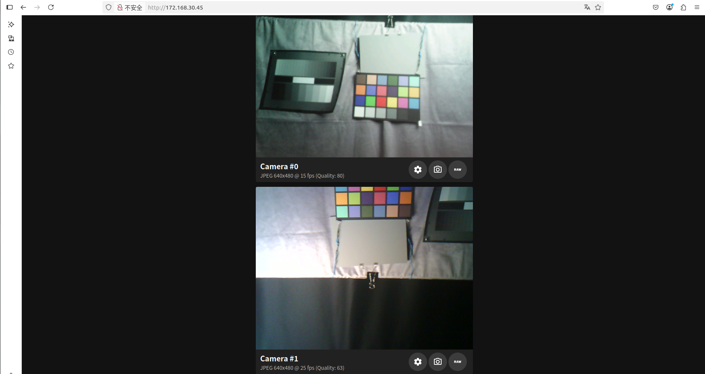

| Supported Targets | ESP32-P4 | ESP32-S3 | ESP32-C3 | ESP32-C6 | ESP32-C5 |
|-------------------|----------|----------|----------|----------|----------|

# Simple Video Server Example

*(See the [README.md](../README.md) file in the upper level [examples](../) directory for more information about examples.)*

## Overview

This example demonstrates how to create multiple HTTP servers on a local network using different ports. These servers can be accessed through a web browser to provide various video streaming and image capture functionalities.

## API Endpoints

The example provides the following REST API endpoints:

| Port | Endpoint | Method | Description |
|:----:|:---------|:------:|:------------|
| 80 | `/` | GET | Serves the main HTML page for browser-based video display |
| 80 | `/api/capture_image?source={n}` | GET | Returns JPEG-formatted images from the specified camera sensor.<br/>**Parameter**: `n` - Camera sensor number (0 = first sensor, 1 = second sensor)<br/>**Example**: `/api/capture_image?source=0` |
| 80 | `/api/capture_binary?source={n}` | GET | Returns raw binary image data from the specified camera sensor.<br/>**Parameter**: `n` - Camera sensor number (0 = first sensor, 1 = second sensor)<br/>**Example**: `/api/capture_binary?source=0` |
| 80 | `/api/get_camera_info` | GET | Retrieves information about all camera sensors, including resolution and JPEG compression settings |
| 80 | `/api/set_camera_config` | POST | Configures camera sensor settings including resolution and JPEG compression |
| 81 | `/stream` | GET | Provides continuous MJPEG stream from the **first** camera sensor (*1) |
| 82 | `/stream` | GET | Provides continuous MJPEG stream from the **second** camera sensor (*1) |

> **Note (*1)**: The server continuously streams JPEG images from the background to the client. When saving images from the webpage, the saved images may not reflect real-time data.

### Domain Name Access

By default, the example enables mDNS (Multicast DNS), allowing you to access the server using a domain name instead of an IP address. For example:
- Image capture: `http://esp-web.local/api/capture_image?source=0`
- Main interface: `http://esp-web.local`

You can also access all URLs using the device's IP address directly.

## Getting Started

### Hardware Configuration

Before using this example, please refer to the [video initialization configuration guide](../common_components/example_video_common/README.md) for detailed information about:
- Board-level configuration
- Camera sensor interface setup
- GPIO pin assignments
- Clock frequency settings

### Project Configuration

Open the project configuration menu:

```bash
idf.py menuconfig
```

#### Network Connection Setup

Navigate to **Example Connection Configuration**:

**Wi-Fi Interface Configuration:**
- **Wi-Fi SSID and Password**: Required for ESP32 to connect to your network
- **SoftAP Settings**: Configure if you want the ESP32 to work as an Access Point

**Ethernet Interface Configuration:**
- **PHY Model**: Select your PHY model (e.g., IP101) in `Ethernet PHY` option
- **PHY Address**: Set based on your board schematic in `PHY Address` option  
- **Clock Configuration**: Configure EMAC Clock mode and SMI GPIO pins

**Wi-Fi Remote Configuration** (for devices without native WiFi support):

[esp_wifi_remote](https://github.com/espressif/esp-protocols/tree/master/components/esp_wifi_remote) is used by default to provide additional WiFi interface capability.

In the `Wi-Fi Remote` menu:
- Select the slave target to connect to the MCU

#### Camera Sensor Configuration

Navigate to **Espressif Camera Sensors Configurations**:
- Select the camera sensor you want to use
- Choose the target output format for the sensor

#### Example-Specific Configuration

1. **Set the target platform:**
   ```bash
   idf.py set-target esp32p4
   idf.py menuconfig
   ```

2. **Configure video buffer settings:**
   ```
   Example Configuration  --->
       (2) Camera video buffer number
   ```
   
   > **Recommendation**: More buffers provide better performance and reduce frame drops but consume more memory. For high-resolution sensors (e.g., 1080P), use 2 buffers.

3. **Set JPEG compression quality:**
   ```
   Example Configuration  --->
       (80) JPEG compression quality (%)
   ```
   
   > **Note**: Not all camera sensors support this setting. If unsupported, the example will automatically select the nearest supported value.

4. **HTTP and mDNS configuration:**
   ```
   Example Configuration  --->
       (123456789000000000000987654321) HTTP part boundary
       (web-cam) mDNS instance
       (esp-web) mDNS host name
   ```
   
   > **Recommendation**: Keep these default settings unless you have specific requirements.

5. **Camera sensor interface selection:**
   
   The example will initialize all enabled camera sensors and stream their output to clients:
   
   ```
   Example Video Initialization Configuration  --->
       Select and Set Camera Sensor Interface  --->
           [*] MIPI-CSI  ---
           [*] DVP  ---->
   ```

6. **Shared I2C bus configuration:**
   
   If your camera sensors share the same I2C GPIO pins (such as MIPI-CSI and DVP sensors on the ESP32-P4-Function-EV-Board V1.5):
   
   ```
   Example Video Initialization Configuration  --->
       [*] Use Pre-initialized SCCB(I2C) Bus for All Camera Sensors And Motors
           (0) SCCB(I2C) Port Number
           (8) SCCB(I2C) SCL Pin
           (7) SCCB(I2C) SDA Pin
   ```

7. **Select target camera sensors:**
   
   Choose sensors based on your development board:
   
   ```
   Component config  --->
       Espressif Camera Sensors Configurations  --->
           Camera Sensor Configuration  --->
               Select and Set Camera Sensor  --->
                   [ ] GC0308  ----
                   [*] GC2145  --->
                   [*] OV2640  ---->
   ```

8. **Optimize DVP interface performance:**
   
   For better frame rates with DVP interface camera sensors:
   
   ```
   Component config  --->
       Espressif Camera Sensors Configurations  --->
           Camera Sensor Configuration  --->
               Select and Set Camera Sensor  --->
                   [*] OV2640  ---->
                       Select default output format for DVP interface (JPEG 640x480 25fps, DVP 8-bit, 20M input)  --->
                           ( ) YUV422 640x480 6fps, DVP 8-bit, 20M input
                           (X) JPEG 640x480 25fps, DVP 8-bit, 20M input
                           ( ) RGB565 240x240 25fps, DVP 8-bit, 20M input
   ```

## Building and Running

1. **Build and flash the project:**
   ```bash
   idf.py -p PORT flash monitor
   ```
   
   *(Press `Ctrl-]` to exit the serial monitor)*

2. **For complete setup instructions**, see the [ESP-IDF Getting Started Guide](https://docs.espressif.com/projects/esp-idf/en/latest/esp32p4/get-started/index.html).

## Expected Output

When running this example, you should see output similar to this in the serial monitor:

```
...
I (1628) main_task: Started on CPU0
I (1638) esp_psram: Reserving pool of 32K of internal memory for DMA/internal allocations
I (1638) main_task: Calling app_main()
I (1648) mdns_mem: mDNS task will be created from internal RAM
I (1698) esp_eth.netif.netif_glue: 60:55:f9:fb:c2:3a
I (1698) esp_eth.netif.netif_glue: ethernet attached to netif
I (3298) ethernet_connect: Waiting for IP(s).
I (3298) ethernet_connect: Ethernet Link Up
I (4648) ethernet_connect: Got IPv6 event: Interface "example_netif_eth" address: fe80:0000:0000:0000:6255:f9ff:fefb:c23a, type: ESP_IP6_ADDR_IS_LINK_LOCAL
I (5298) esp_netif_handlers: example_netif_eth ip: 172.168.30.45, mask: 255.255.255.0, gw: 172.168.30.1
I (5298) ethernet_connect: Got IPv4 event: Interface "example_netif_eth" address: 172.168.30.45
I (5298) example_common: Connected to example_netif_eth
I (5308) example_common: - IPv4 address: 172.168.30.45,
I (5308) example_common: - IPv6 address: fe80:0000:0000:0000:6255:f9ff:fefb:c23a, type: ESP_IP6_ADDR_IS_LINK_LOCAL
I (5318) example_init_video: MIPI-CSI camera sensor I2C port=0, scl_pin=8, sda_pin=7, freq=100000
I (5328) example_init_video: DVP camera sensor I2C port=1, scl_pin=8, sda_pin=7, freq=100000
I (5378) ov2640: Detected Camera sensor PID=0x26
I (5378) gc2145: Detected Camera sensor PID=0x2145
I (5808) example: video0: width=640 height=480 format=RGBP
W (5908) example: JPEG compression quality=80 is out of sensor's range, reset to 63
I (5908) example: video1: width=640 height=480 format=JPEG
I (5908) example: Starting stream server on port: '80'
I (5918) example: Camera web server starts
I (5918) main_task: Returned from app_main()
...
```

## Accessing the Web Interface

1. **Open your web browser** and navigate to one of the following:
   - `http://esp-web.local` (using mDNS)
   - `http://172.168.30.45` (replace with your device's IP address from the log output)

2. **Web interface features:**
   - View live video streams from connected cameras
   - **Camera Icon**: Download JPEG-formatted images from the selected video streams
   - **Raw Icon**: Download raw binary image data from the selected video streams
   - **Gear Icon**: Configure the image parameters to the selected video streams



## Troubleshooting

### Common Issues

**1. I2C Transaction Errors**

```
E (1595) i2c.master: I2C transaction unexpected nack detected
E (1595) i2c.master: s_i2c_synchronous_transaction(870): I2C transaction failed
```

**Solutions:**
- Verify that the camera sensor is properly connected to the development board
- Check that the I2C pins (SCL/SDA) are correctly configured in menuconfig
- Ensure the I2C pull-up resistors are present on your board
- Verify the camera sensor power supply is stable
